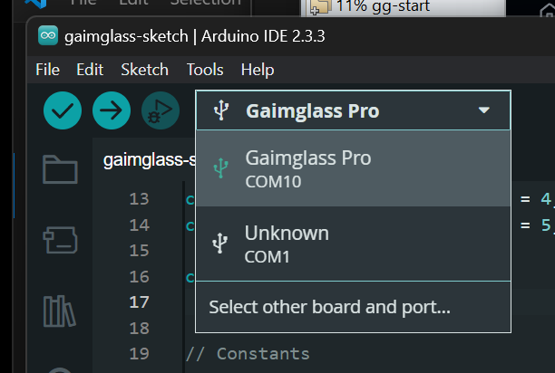
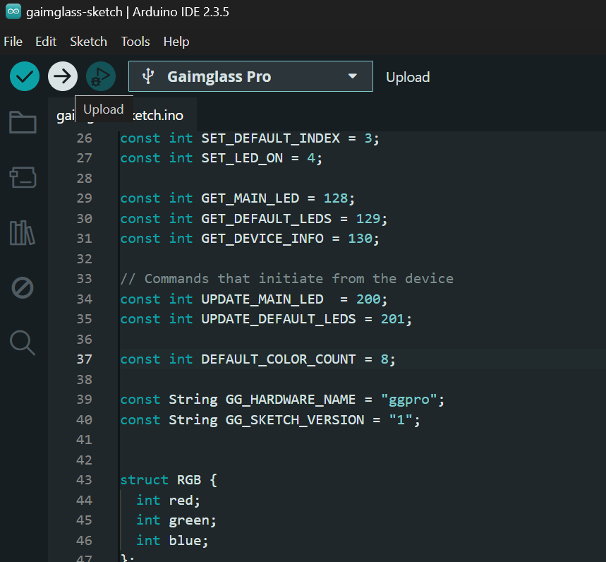
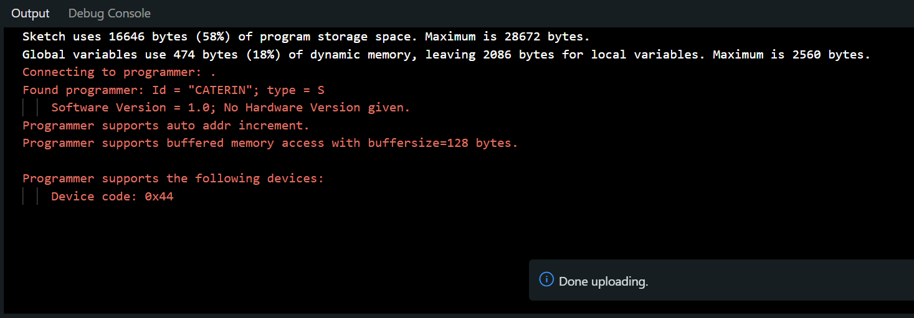

# Instructions
This repository is a modified copy of the local Arduino folder `avr\1.8.6` from the Arduino IDE installation. _Compatible with IDE version `2.3.5`_

This will allow you to set up the Gaimglass PRO board in the Arduino IDE as such:




## How to install locally

### 1. Install the Arduino IDE 2.3.x locally.

https://www.arduino.cc/en/software


### 2. Run the program to install the default boards
Open and run the program. This will download the `hardware\arduino\avr` folder for the first time

### 2. Copy and replace the `\1.8.6` folder

Copy the entire `\1.8.6` folder from this repository and replace your local `\1.8.6` folder on your Windows PC

For example:
`C:\Users\<username>\AppData\Local\Arduino15\packages\arduino\hardware\avr\1.8.6`
_Replace `<username>` with your windows username_

You do not actually need to replace all the files. Only 3 files are different detailed below

#### Replace:
```
1.8.6\boards.txt
1.8.6\platform.txt
```

#### Add
```
1.8.6\variants\gaimglass\pins_arduino.h
```
> note: create the `\gaimglass` folder


You can see the diff of these 3 files here https://github.com/Gaimglass/gg-arduino-board/commit/378d8ed02d61345e2cb5927cb2bc1b1ccc355388


### To upload the the Gaimglass sketch

1. Unplug the LED from the Gaimglass PCBA. This allows the ATMega to reboot into the bootloader on a separate COM port. 

2. Ensure nothing is using the same COM port at the device such as the Gaimglass electron app. Close it if needed.

3. Open the Arduino IDE and click "Open" and find the [gaimglass-sketch.ino](https://github.com/Gaimglass/gg-sketch/blob/main/gaimglass-sketch/gaimglass-sketch.ino) file


4. Click the Upload button. This will automatically build then then upload the sketch on the bootloader COM port.



5. When its finished, you may see an error but if it says "Done Uploading" in the bottom right, then it worked. Just ignore the error.



6. Plug the LED back in. All the Gaimglass buttons and features should how work.


## Trouble shooting
[Install Directory](https://forum.arduino.cc/t/ide-2-0-2-install-directory-missing/1056414/3)

[Arduino IDE - Creating Custom Boards](/Arduino_IDE_tutorial.pdf)

https://www.instructables.com/Arduino-IDE-Creating-Custom-Boards/

